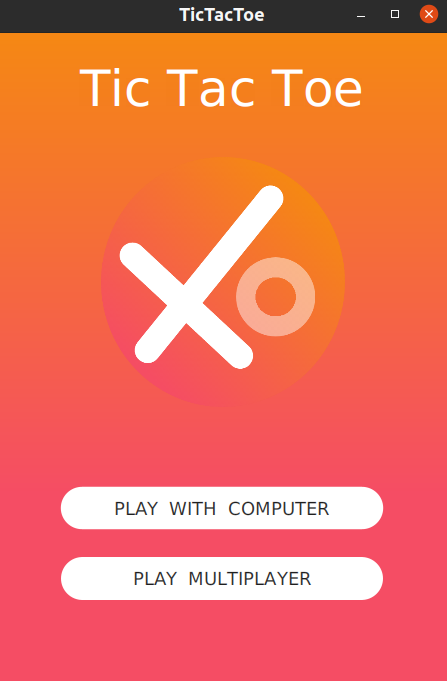
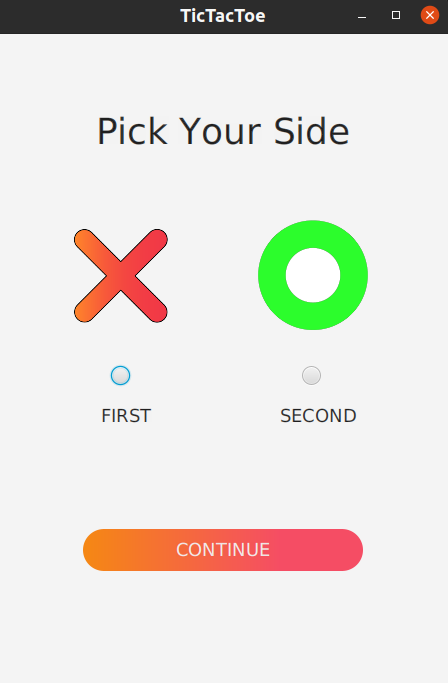
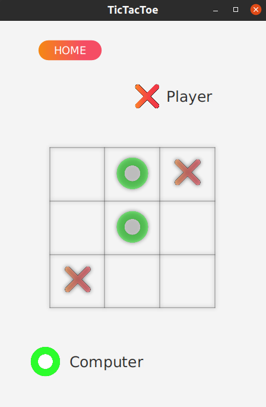
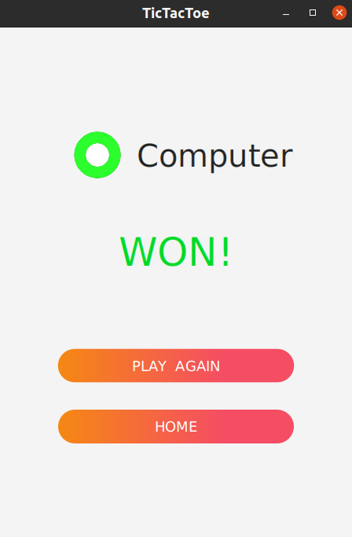

# TicTacToe

**TicTacToe** is a GUI-based desktop game application built with `Java` and `JavaFX` 

## Setup

### Requirements

- JDK >= 11
- JavaFx SDK v.16

## Screenshots

### Home Screen

### Pick Side Screen

### Gameplay Screen

### Result Screen

